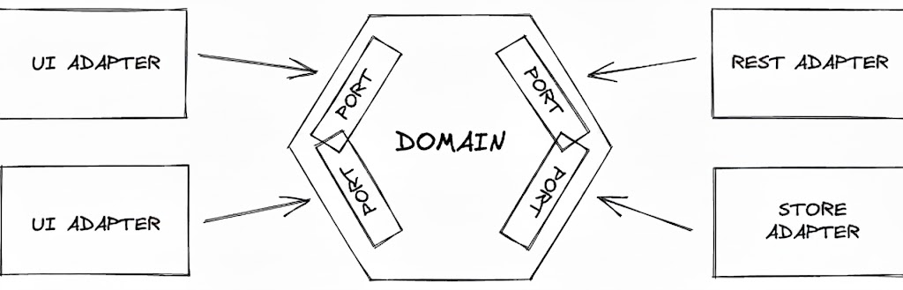

# GT Motive - Vehicle Browser

Angular application to explore vehicle manufacturers and models, built with hexagonal architecture and the latest Angular 20 features.


## Main Features

- Vehicle manufacturers exploration
- Real-time search and filtering
- Vehicle types and models visualization by manufacturer
- Scalable and maintainable architecture
- Reactive state management with NgRx
- Modern UI with Material Design

## Compliance with Requirements

This application meets all the specified requirements:

- **Single Page Application (SPA)**: Developed using Angular.
- **Vehicle Information Display**: Utilizes the NHTSA API (https://vpic.nhtsa.dot.gov/api) to fetch vehicle information.
- **Initial Display of Brands**: The application starts by displaying available vehicle brands using virtual scrolling for efficient rendering.
- **Search Functionality**: A search engine is implemented to filter the displayed brands in real-time.
- **Brand Detail Route**: Selecting a brand navigates to a new route that provides detailed information about the selected brand, including:
  - Types of vehicles
  - Available models
- **Recommended Technologies**:
  - **NgRx**: For state management, ensuring efficient data handling and avoiding repeated API calls.
  - **RxJS**: For reactive programming, allowing for better management of asynchronous data streams.
  - **Angular Material**: For a modern and responsive UI design.
- **Code Readability and Maintainability**: The architecture is designed with readability and maintainability in mind, following best practices.
- **Testing**: Comprehensive tests have been developed to ensure the functionality and reliability of the application.


## Hexagonal Architecture (Ports & Adapters)

This project follows the hexagonal architecture pattern to separate concerns and make the code more maintainable and testable.



## Project Structure

```
src/
├── app/
│   ├── core/                    # Application infrastructure
│   │   └── layout/              # Shell and navigation
│   ├── features/                # Feature modules
│   │   ├── brands/              # Feature: Manufacturers listing
│   │   └── brand-detail/        # Feature: Manufacturer detail
│   └── app.ts                   # Root component
└── ...
```

### Layer Structure

```
features/{feature-name}/
├── domain/              # Pure business logic (no Angular dependencies)
│   ├── models/          # Domain entities and types
│   └── ports/           # Interfaces for external dependencies
├── application/         # Use cases and business workflows
│   └── use-cases/       # Application services
├── infrastructure/      # External dependencies implementation
│   ├── adapters/        # HTTP services, APIs
│   └── store/           # NgRx (actions, reducers, selectors, effects)
└── adapters/ui/         # Presentation layer
    ├── components/      # Presentational components
    └── *.component.ts   # Page components
```

### Architectural Principles

1. **Domain Layer**: Pure TypeScript code, no Angular dependencies
2. **Use Cases**: Inject NgRx Store, return observables from selectors
3. **Infrastructure**: NgRx Effects handle API calls with caching logic
4. **UI Components**: Use signals via `toSignal()`, OnPush change detection

### Data Flow

```
UI Component → Use Case → Store (dispatch action) → Effect → API Adapter
                ↓                                      ↓
           Selectors ← Reducer ← Action ← Response ←──┘
                ↓
            Signals
```

## Technologies

| Technology          | Version | Purpose               |
|---------------------|---------|-----------------------|
| **Angular**         | 20.3    | Main framework        |
| **NgRx**            | 19.0    | State management      |
| **Material Design** | 20.3    | UI components         |
| **RxJS**            | 7.8     | Reactive programming  |
| **TypeScript**      | 5.9     | Language              |
| **Jasmine/Karma**   | -       | Testing               |
| **pnpm**            | 10.18   | Package manager       |

## Modern Angular Patterns

This project uses the latest Angular 20 features:

- **Standalone Components**: No NgModules
- **Signals**: `signal()`, `computed()`, `effect()`, `toSignal()`
- **Input/Output Functions**: `input()`, `input.required()`, `output()`
- **Control Flow**: `@if`, `@for`, `@switch` (instead of `*ngIf`, `*ngFor`)
- **Inject Function**: For dependency injection
- **Zoneless Change Detection**: Enabled via `provideZonelessChangeDetection()`

## Prerequisites

- Node.js 20.x or higher
- pnpm 10.x

## Installation

```bash
# Install dependencies
pnpm install
```

## Development Commands

### Development Server

```bash
pnpm start
```

Open your browser at `http://localhost:4200/`. The application will automatically reload when you modify files.

### Production Build

```bash
pnpm run build
```

Build artifacts will be generated in the `dist/` directory.


### Tests

```bash
# Run tests in watch mode
pnpm test

# Run tests in CI (headless)
pnpm test:ci
```

**Current status**: 108 tests passing ✅

### Implemented Features

#### 1. Brands (Manufacturers)
- Manufacturers listing with virtual scroll (CDK Scrolling)
- Reactive search with debounce (300ms)
- Results counter
- Navigation to detail

#### 2. Brand Detail (Manufacturer Detail)
- Vehicle types by manufacturer
- Vehicle models
- Loading and error states management
- NHTSA API integration

## NgRx Configuration

Features are registered in `app.config.ts`:

```typescript
provideStore({
  manufacturers: manufacturersReducer,
  brandDetail: brandDetailReducer,
})
provideEffects([ManufacturersEffects, BrandDetailEffects])
```

## Testing

Each architecture layer has its corresponding tests:

- **Domain**: Model and type tests
- **Use Cases**: Tests with MockStore
- **Store**: Tests for reducers, selectors and effects
- **Components**: Tests with provideZonelessChangeDetection

## Additional Resources

- [Angular Documentation](https://angular.dev)
- [NgRx Documentation](https://ngrx.io)
- [Material Design](https://material.angular.io)
- [NHTSA API](https://vpic.nhtsa.dot.gov/api/)
